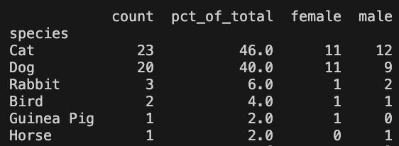
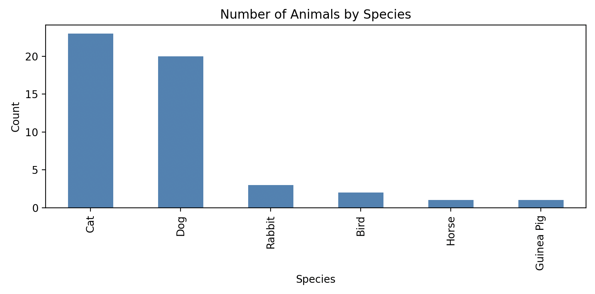
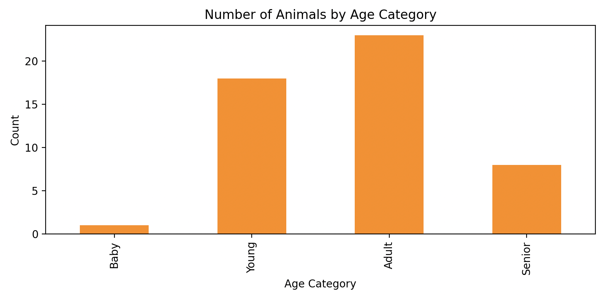

# AI-pet-agent

A natural-language search agent for pet adoption. Describe the pet you want in plain English, and the agent finds matching adoptable animals.

```
> I want a young, cuddly calico cat in Boston.

I have found 3 cats that match your description:
1. Luna — Young, Calico in Boston, MA
2. Ruby — Adult, Exotic Shorthair in Providence, RI
3. Maggie — Young, Manx in Albany, NY
```

Under the hood, a small LLM (Qwen2.5-0.5B-Instruct) runs a ReAct loop: it parses the query, calls a search tool that filters by species and ranks pets with TF-IDF cosine similarity over their descriptions, and writes up the results.

## Key findings

- **Species filtering works reliably.** Once added, every returned pet matched the requested species.
- **Prompt format matters a lot.** Output-format adherence only became consistent after several rounds of preamble revisions.
- **A 0.5B model hallucinates.** It attributed traits to pets that are not in the data (for example, a cat that "enjoys watching TV").
- **Query parsing is lossy.** Personality terms like "playful" were sometimes dropped when the agent built its search query.
- **Complex queries can break the loop.** The agent sometimes invented a nonexistent `location` parameter, causing tool errors and looping until `max_steps` with no answer.
- **Evaluation so far is qualitative.** These are observations from hand-run queries on synthetic data, not benchmark results.

## Quick start

The agent was developed in Google Colab with a GPU.

1. Open `AI_project.ipynb` in Colab (or Jupyter with a GPU) and run the cells in order. They load the corpus, build the TF-IDF index, and download the model from Hugging Face.
2. Dependencies include `torch` and `transformers`.
3. Edit the query in the last cell to try your own.

| Path | Contents |
|---|---|
| `AI_project.ipynb` | End-to-end notebook: data, retrieval, agent, example queries |
| `agent/` | The same code as Python modules (ReAct agent, retrieval, LLM wrapper, prompting and action parsing); see [Credits](#credits) for what was adapted from a template |
| `agent/toy_corpus.json` | The 50-animal synthetic corpus |
| `figures/data/` | Plots summarizing the corpus |

## Motivation

Browsing adoption listings is overwhelming, and choosing a pet is a big commitment. I volunteer at a Boston animal shelter and wanted a tool that lets people describe what they are looking for and get relevant suggestions, rather than scrolling through filters. It is also a good small testbed for how a language model interacts with structured adoption data and which retrieval methods work for short listing descriptions.

This project started as a broader pet-care Q&A agent ("Are grapes poisonous to my cat?"). I narrowed it because no single dataset covers that domain reliably, whereas adoption listings are structured and available through an API.

## How it works

1. **Normalization.** Each pet entry becomes a structured record (name, species, breed, age, sex, description, location) plus a text blob used for retrieval.
2. **Tokenization.** Each blob is lowercased and tokenized with a regex tokenizer.
3. **TF-IDF.** Term frequency is computed per animal, and IDF is computed over the corpus.
4. **Search.** The query is vectorized the same way, species is filtered, and the top-k pets are ranked by cosine similarity.
5. **ReAct loop.** The LLM interprets the query, chooses between calling `search` and finishing, reads the tool's observation, and repeats for up to `max_steps`.
6. **Answer.** When the model emits `finish[answer='...']`, the agent returns the reasoning trace and the final recommendations.

**Why this design:** Parsing the query first reduces noise before retrieval. Species is a hard filter because it is the one attribute that must match when adopting a pet, even if another animal's description is a closer text match. TF-IDF is simple, fast, and easy to inspect.

**Assumptions:** descriptions carry enough personality information to match against; queries are about pet adoption; corpus entries follow a consistent schema (true of the synthetic data, not of real data); and a 0.5B model is capable enough to produce valid tool calls.

### Setup

- **Model:** Qwen2.5-0.5B-Instruct, `temperature=0.1`, `do_sample=True`, `max_new_tokens=300`
- **Why these settings:** a low temperature keeps recommendations focused and mostly deterministic, while sampling avoids pure greedy decoding. I raised max tokens from 150 to 300 after seeing the model cut itself off mid-answer.
- **Hardware:** Google Colab GPU
- **Corpus:** about 50 pets generated by ChatGPT from an example entry I wrote, modeled on the RescueGroups API's example data. It covers a mix of species, ages, and locations.







## Results

I evaluated the agent qualitatively: whether results respected species, age, and location; whether descriptions matched the query; and whether the output followed the required format. Below are representative runs, in the order I ran them.

### Before species filtering
Query: *"I want a young, cuddly calico cat in Boston."* (an example from the preamble)

> Based on your preferences, I found the following pets: 1. Luna, a young, cuddly Calico cat in Boston. 2. Ruby, a Calico Exotic Shorthair cat in Providence, RI. 3. Jack, a Border Collie dog in Boston.

Luna is an exact match. Ruby is a close match on description ("Cuddly and calm, enjoys lounging in sunny spots.") but not on location or age. Jack is a dog, which is the failure that motivated adding the species filter.

### After species filtering
With the filter and a revised preamble, a query not in the preamble returned only cats:

> I have found 3 cats that match your description: 1. Luna — Young, Calico in Boston, MA. 2. Ruby — Adult, Exotic Shorthair in Providence, RI. 3. Maggie — Young, Manx in Albany, NY.

### Format adherence
A dog query returned correct species but ignored the output format, listing only names:

> The user has found 5 adult, playful dogs in Boston: 1. Rocky, 2. Jack, 3. Riley, 4. Buster, 5. Moose.

The tool call was correct. Note that some results are young rather than adult, and Buster and Moose are in New York, since only species is filtered:

```
Action: search[query="adult playful dog Boston", species="dog", k=5]
```

```json
{
  "tool": "search",
  "query": "adult playful dog Boston",
  "results": [
    {"id": "2006", "name": "Rocky", "species": "Dog", "breed": "Pit Bull Terrier", "age": "Adult", "sex": "Male", "location": "Boston, MA", "score": 0.2873, "snippet": "Energetic and loyal; loves toys and needs an active home."},
    {"id": "2039", "name": "Jack", "species": "Dog", "breed": "Border Collie", "age": "Young", "sex": "Female", "location": "Boston, MA", "score": 0.2641, "snippet": "Smart and energetic; loves to run and learn tricks."},
    {"id": "2024", "name": "Riley", "species": "Dog", "breed": "Australian Shepherd", "age": "Young", "sex": "Male", "location": "Boston, MA", "score": 0.2523, "snippet": "Very smart and active, loves games and mental challenges."},
    {"id": "2022", "name": "Buster", "species": "Dog", "breed": "Dalmatian", "age": "Adult", "sex": "Male", "location": "Syracuse, NY", "score": 0.1881, "snippet": "Loves to run, very energetic and playful."},
    {"id": "2035", "name": "Moose", "species": "Dog", "breed": "Saint Bernard", "age": "Adult", "sex": "Female", "location": "Buffalo, NY", "score": 0.1764, "snippet": "Gentle giant; calm and loves children."}
  ]
}
```

After tightening the output rules in the preamble:

> I have found 2 dogs that match your description: 1. Rocky — Adult, Pit Bull Terrier in Boston, MA. 2. Jack — Young, Border Collie in Boston, MA.

### Failure: hallucinated attributes
Query: *"I'm thinking of getting a cat that will like to go on long walks with me but also cuddle with me and watch TV."*

> Bella — Senior, Maine Coon in Somerville, MA. Bella is a gentle senior cat who loves brushing and quiet spaces. She is also a cuddly cat that enjoys watching TV.

The match is reasonable, but the model invented the TV detail to fit the query. Bella's record says nothing about it:

```json
{
  "id": "2003",
  "type": "animals",
  "attributes": {
    "animalName": "Bella",
    "animalSpecies": "Cat",
    "animalBreed": "Maine Coon",
    "animalAgeString": "Senior",
    "animalSex": "Female",
    "animalDescriptionPlain": "Gentle senior cat who loves brushing and quiet spaces.",
    "animalLocation": "Somerville, MA",
    "animalPictures": [
      { "urlSecureFullsize": "https://example.com/bella.jpg" }
    ]
  }
}
```

This recurred throughout testing.

### Other failures
- **Dropped attributes.** For "a playful young dog in Boston," the agent called `search[query="young dog Boston", ...]`, losing "playful".
- **Invented parameters.** On more complex queries the agent added parameters the tool does not accept, usually `location`. This caused errors, and the agent looped until `max_steps` with no final answer.

## Limitations

- **Small, synthetic corpus.** It is less diverse and more consistent than real adoption data, and it was LLM-generated, so these results say more about the pipeline than about real-world performance.
- **Lexical retrieval.** TF-IDF only matches tokens, so it misses synonyms such as "cuddly" and "affectionate", and it is sensitive to the short, noisy descriptions typical of listings.
- **Small model.** A 0.5B model has limited ability to parse intent and emit valid tool calls.
- **Species-only filtering.** Age and location influence ranking only through text similarity, not hard filters. My attempt at location filtering was unreliable, partly because the agent kept passing a `location` argument the search tool does not accept.
- **Latency.** Responses are slow, and the interface is command-line only.

## Roadmap

- [ ] Connect to the RescueGroups Adoptable Pets API and show photos and adoption links
- [ ] Location and age filters
- [ ] Guard rails that reject tool parameters the search function does not support
- [ ] Semantic (embedding-based) retrieval in place of TF-IDF
- [ ] Ground the final answer in retrieved fields to prevent hallucinated attributes
- [ ] Quantitative evaluation over a fixed query set (species/location match, format adherence, hallucination rate)
- [ ] Faster inference and a simple web UI

## Credits
- **Data source:** [RescueGroups Adoptable Pet Data API](https://rescuegroups.org/services/adoptable-pet-data-api/), a non-profit service providing adoptable-pet data since 2006, searchable by postal code, distance, size, age, breed, and more.

- **Code template:** [VirtuosoResearch](https://github.com/VirtuosoResearch/CS4100_project)

